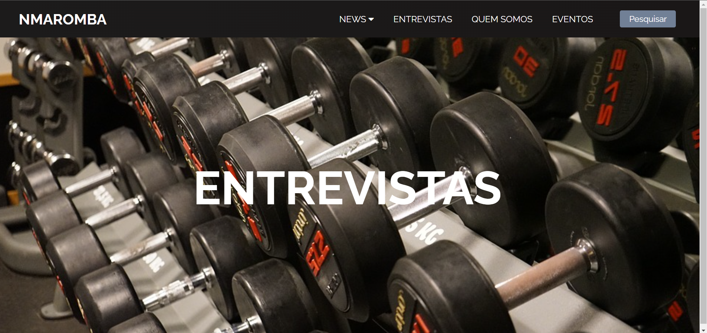

# README

 Esse projeto é E-comerce  

[Prévia](#Prévia)

# Prévia

---
 

<h4 align="center">
 🚧 Projeto WebSite ReactJs 🚀 Em construção 🚧...
  </h4>

### Features
- [X] Criar Título
- [X] Criar Descrição
- [X] GIF's

<h1 align="center">
  
</h1>
